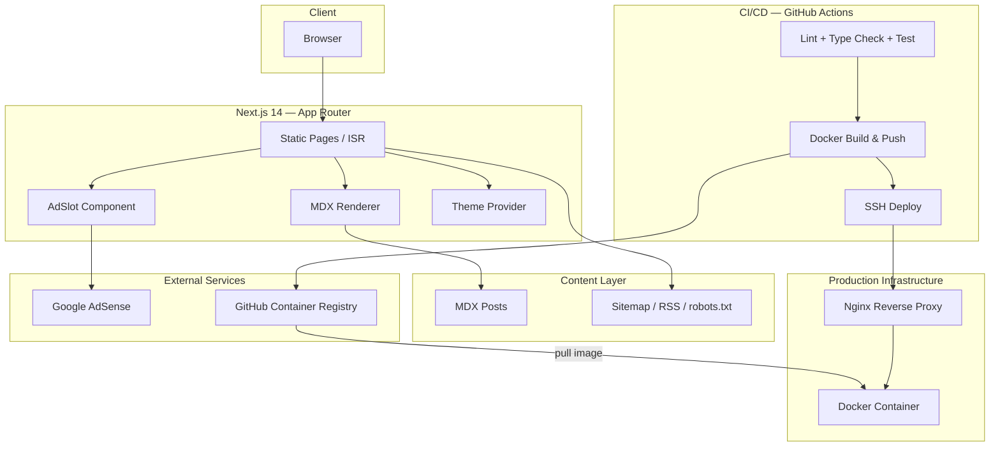

# Prathiush.dev

A production-grade personal blog built with Next.js 14 App Router, TypeScript, Tailwind CSS, and MDX. Designed as a complete content platform — not just a blog template — with SEO, monetization, containerization, and a full CI/CD pipeline.

---

## Architecture



---

## Features

- **MDX authoring** — write posts in Markdown with full JSX component support
- **Dark / Light mode** — system preference detection + manual toggle via `next-themes`
- **Google AdSense** — env-gated ad slots; dev placeholders render when publisher ID is absent
- **SEO** — Open Graph, Twitter cards, XML sitemap, `robots.txt`, RSS feed
- **Reading time** — computed per post at build time
- **Tags** — tag index page and filtered tag views
- **Docker** — multi-stage build, non-root user, health check endpoint
- **CI/CD** — GitHub Actions: lint → type-check → test → Docker push → SSH deploy

---

## Quick Start

```bash
git clone https://github.com/prathiusharun/blog.git
cd blog
npm install
cp .env.example .env.local
# Set NEXT_PUBLIC_SITE_URL=http://localhost:3000
npm run dev
```

**Docker (local)**

```bash
docker compose up --build
```

---

## Writing Posts

Create a `.mdx` file under `src/content/posts/`:

```mdx
---
title: "My Post Title"
description: "Short description for SEO and post cards."
date: "2024-10-01"
tags: ["Next.js", "TypeScript"]
draft: false
---

Your content here. Full **Markdown** and JSX supported.
```

Posts are automatically discovered, sorted by date, and statically generated at build time. Setting `draft: true` excludes a post from production builds.

---

## Monetization

1. Get your publisher ID from [Google AdSense](https://adsense.google.com) — format: `ca-pub-XXXXXXXXXXXXXXXX`
2. Add to `.env.local`:

```env
NEXT_PUBLIC_ADSENSE_ID=ca-pub-XXXXXXXXXXXXXXXX
```

3. Replace placeholder slot IDs in `src/app/page.tsx` and `src/app/posts/[slug]/page.tsx` with real slot IDs from your AdSense dashboard
4. The `adsbygoogle.js` script loads automatically via `src/app/layout.tsx`

In development, placeholder boxes are rendered wherever ad slots appear.

---

## Docker

**Build**

```bash
docker build \
  --build-arg NEXT_PUBLIC_SITE_URL=https://prathiush.dev \
  -t prathiush-blog:latest .
```

**Run**

```bash
docker run -p 3000:3000 \
  -e NODE_ENV=production \
  prathiush-blog:latest
```

**Production Compose**

```bash
IMAGE_TAG=latest \
NEXT_PUBLIC_SITE_URL=https://prathiush.dev \
docker compose -f docker-compose.prod.yml up -d
```

---

## CI/CD

Every push to `main` triggers the full pipeline:

| Step | What happens |
|------|-------------|
| Quality | `type-check` + `lint` + `test` |
| Build & Push | Multi-platform Docker image → GitHub Container Registry |
| Deploy | SSH into server, pull new image, zero-downtime restart |

**Required GitHub Secrets**

| Secret | Description |
|--------|-------------|
| `NEXT_PUBLIC_SITE_URL` | Production URL |
| `NEXT_PUBLIC_ADSENSE_ID` | AdSense publisher ID |
| `DEPLOY_HOST` | Server IP or hostname |
| `DEPLOY_USER` | SSH username |
| `DEPLOY_SSH_KEY` | Private SSH key |

---

## Project Structure

```
├── src/
│   ├── app/
│   │   ├── layout.tsx          # Root layout, theme provider
│   │   ├── page.tsx            # Home page
│   │   ├── about/              # About page
│   │   ├── posts/[slug]/       # Individual post pages
│   │   ├── tags/               # Tag index + filtered views
│   │   ├── api/health/         # Health check endpoint
│   │   ├── rss.xml/            # RSS feed
│   │   ├── robots.txt/         # robots.txt
│   │   └── sitemap.ts          # XML sitemap
│   ├── components/
│   │   ├── Navbar.tsx          # Navigation + theme toggle
│   │   ├── Footer.tsx
│   │   ├── PostCard.tsx
│   │   └── AdSlot.tsx          # AdSense slot wrapper
│   ├── content/
│   │   └── posts/              # MDX posts live here
│   ├── lib/
│   │   ├── posts.ts            # File-system MDX utilities
│   │   └── types.ts            # Shared TypeScript types
│   └── styles/
│       └── globals.css         # Tailwind + custom CSS
├── nginx/
│   ├── nginx.prod.conf         # HTTPS, rate limiting
│   └── nginx.dev.conf
├── .github/workflows/
│   └── ci-cd.yml
├── Dockerfile
├── docker-compose.yml          # Local dev
├── docker-compose.prod.yml     # Production
└── .env.example
```

---

## Tech Stack

| Layer | Technology |
|-------|-----------|
| Framework | Next.js 14 App Router |
| Language | TypeScript |
| Styling | Tailwind CSS |
| Content | MDX |
| Containerization | Docker |
| Reverse Proxy | Nginx |
| CI/CD | GitHub Actions |
| Registry | GitHub Container Registry |
| Monetization | Google AdSense |// force redeploy
